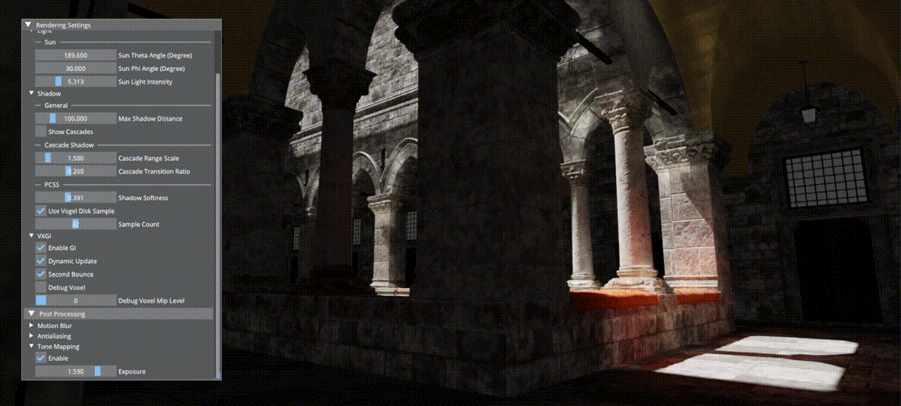

# YARenderer

Yet another renderer built with C++ and Directx12 from scratch. 

The goal of this project is to learn Directx12 API and implement some common graphics algorithms (without focusing on optimization). Everything is simple and straight forward which should be helpful for other graphics programming beginners like me :)

## Features

- Deferred Rendering
- Voxel-based Global Illumination
- Directional Light
  - Cascaded Shadow
  - PCSS
- Image-Based Lighting
- Screen Space Ambient Occlusion
- Post Processing
  - Motion Blur
  - Tone Mapping
  - Anti-Aliasing
    - FXAA
    - TAA

## Gallery

## References

### Websites / Blogs

[Forward vs Deferred vs Forward+ Rendering with DirectX 11 | 3D Game Engine Programming (3dgep.com)](https://www.3dgep.com/forward-plus/)

[Learn OpenGL, extensive tutorial resource for learning Modern OpenGL](https://learnopengl.com/)

[Cascade Shadow Map 实现记录 - 知乎 (zhihu.com)](https://zhuanlan.zhihu.com/p/515385379)

[Integrating Realistic Soft Shadows Into Your Game Engine (nvidia.com)](https://developer.download.nvidia.com/whitepapers/2008/PCSS_Integration.pdf)

[Implementing FXAA - 2016/07/30 (simonrodriguez.fr)](http://blog.simonrodriguez.fr/articles/2016/07/implementing_fxaa.html)

[Alex Tardif: Temporal Antialiasing Starter Pack](https://alextardif.com/TAA.html)

[Voxel-based Global Illumination – Wicked Engine](https://wickedengine.net/2017/08/30/voxel-based-global-illumination/)

[Global Illumination Using Voxel Cone Tracing – Andrew Pham (andrew-pham.blog)](https://andrew-pham.blog/2019/07/29/voxel-cone-tracing/)

[Bindless Rendering in DirectX12 and SM6.6 | Tarun Ramaswamy (rtarun9.github.io)](https://rtarun9.github.io/blogs/bindless_rendering/)

... (and many other helpful resources that I don't remember the origin of)

### GitHub Repos

[d3dcoder/d3d12book: Sample code for the book "Introduction to 3D Game Programming with DirectX 12" (github.com)](https://github.com/d3dcoder/d3d12book)

[Nadrin/PBR: An implementation of physically based shading & image based lighting in D3D11, D3D12, Vulkan, and OpenGL 4. (github.com)](https://github.com/Nadrin/PBR)

[pkurth/D3D12Renderer: Custom renderer and physics engine written from scratch in C++/Direct3D 12. (github.com)](https://github.com/pkurth/D3D12Renderer)

[LanLou123/DXE: A voxel cone traced realtime Global Illumination rendering engine in dx12, wip (github.com)](https://github.com/LanLou123/DXE)

[rtarun9/Helios: DirectX12 Graphics renderer used for implementing rendering techniques such as PBR / IBL, Deferred Shading, SSAO, Bloom, Shadow Mapping, etc :dizzy: (github.com)](https://github.com/rtarun9/Helios)

### Models

[Low Poly Winter Scene](https://sketchfab.com/3d-models/low-poly-winter-scene-2ffe1ed449414cc184078dd1e2882284)

[Sponza Scene](https://www.intel.com/content/www/us/en/developer/topic-technology/graphics-research/samples.html)